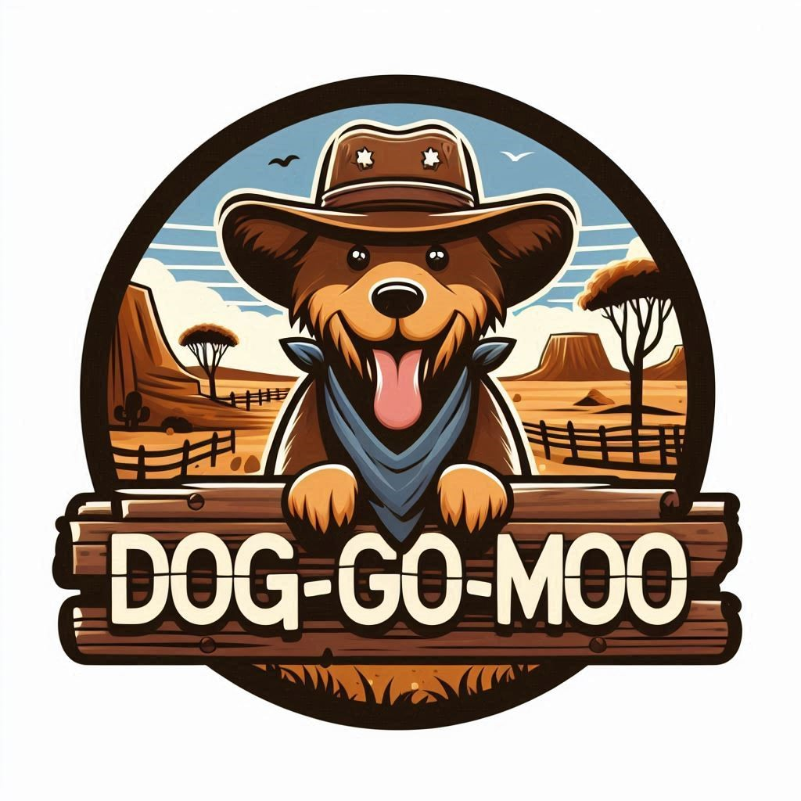

# Dog-go-moo



A docker container with [megadetector](https://github.com/microsoft/CameraTraps/blob/main/megadetector.md) 
v5 and [yolov10](https://github.com/THU-MIG/yolov10) models installed. 
This will facility rapid removal of 
empty images from camera trap datasets. In my testing the 
false negative rate is <1%. The false positive rate 
is somewhat higher (~3-5%) depending on the
background.  

[Yolov10](https://github.com/THU-MIG/yolov10) can be used 
to further categorise images,
however, only a limited number of 
[class labels](#yolo-class-labels) are
available. 

The container is tagged `dwheelerau/dog-go-moo:v0.6` and
is based on a cuda image to make Nvidia GPUs available for fast 
inference. On my computer with a GeForce GTX 1660 super it took 50 minutes to 
process ~15,000 camera trap images through both Megadetector and
yolo.     

The pipeline includes scripts that use the MD/Yolo data to partition
the camera trap images based on specific classes: animal, empty, via MD, 
and custom classes available through yolo inference  
see classes [class labels](#yolo-class-labels).   

## Snakemake automated workflow  
[Snakemake](https://snakemake.readthedocs.io/en/stable/) is used to make
a reproducible analysis pipeline. A
`config.yaml` file allows the workflow to be modified as required.  

1. From docker desktop pull the image tagged `dwheelerau/dog-go-moo:v0.6`.  
2. Copy your images to a common directory, ie `data`.  
3. Open a terminal in the `data` directory.
4. Find the image ID using `docker images` command.  
```
docker images
#REPOSITORY                 TAG          IMAGE ID       CREATED             SIZE
#dwheelerau/dog-go-moo      v0.6         ba21f33b2c0a   About an hour ago   12.4GB
```
5. Use the image ID to create and login to a dog-go-moo container  
Linux:  
```
docker run --gpus all -it -v `pwd`:/project ba21f33b2c0a /bin/bash
```
Or Windozs:  
```
# use ${PWD} for powershell
docker run --gpus all -it -v %cd%:/project ba21f33b2c0a /bin/bash
```
6. Now inside the container, change into the dog-go-moo directory.  
```
cd /build/dog-go-moo
```
7. Check options in the `config.yaml` file. The probability cut-off values
can be increased in false positives become an issue. The yolo config 
`create_images` generates images with detections shown with boundary boxes
creates copies of the original images so takes up disk space, but useful
for testing to see how well the model is performing. If you need to edit this
file use the nano or vim editor `nano config.yaml`.     
```
# MD config
md-threshold: 0.3 # threshold for detection using MD
md-model: 'MDV5A' # MD model
base_image_dir: /project/ #image dir, dont change unless you know what you are doing

# yolov config
yolo-model: /build/weights/yolov10l.pt # yolo weight file
create_images: False # creates images with boundary boxes, useful for testing
conf: 0.25 # detection probability cut-off for yolov10
# EDIT BELOW AS WELL
classes: "[16,19]" # list of classes you want to detect, here 16=dog, 19=cow

# yolo sort config
# "--all_true" or "--all_false" 
collect_all_images: "--all_true" 
sort_classes: "16 19" # should be the same as "classes" above
sort_threshold: 0.25 # threshold, should be the same as used for yolo.  
```
8. Run `snakemake --cores all all` to run the pipeline.  

OR 

To just to run megadetector use `snakemake --cores all megadetector` and
then to create a summary CSV run `snakemake --cores all json_to_csv`. The
final results will be summarised in `project.csv`.  

## Outputs   

| file        | desc |  
|-------------|------|
| project.csv | Number of MD detections for each image |
|megadetector-summary.txt | Summary of results for MD detections |
| megadetector| Images sorted by MD: animal, empty, person, vehicle    |
| yolov10     | Yolo detection files                                |
|  yolov10-summary.txt      | Yolo run log                 |
| yolo_sorted | MD class 'animal' images sorted based on user defined classes |
|              |                     |


## Step-by-step workflow if not using snakemake  
1. Find the Docker image ID and start container dog-go-moo mounting the current
working directory that contains your camera trap images.  
```
# find the dog-go-moo image ID
docker images

# in this example the image ID is eb25af9717a5 (yours will be different)
docker run --gpus all -it -v `pwd`:/project eb25af9717a5 /bin/bash
```
The above command will mount your current working directory in `/projects/` 
in the container.  

2. Run Megadetector, assumes your images are in the current working 
directory      
```
# check your images are visible
ls /projects/
# run MD with a threshold of 0.3 for detection. Recursively look for images 
python -m megadetector.detection.run_detector_batch 'MDV5A' /project/ project.json --recursive --threshold 0.3  
```
The above command will create a file of detections called `project.json`.    

3. Run `script/json_to_csv.py` to get a human friendly output from the JSON 
file.  

`python scripts/json_to_csv.py -i project.json -t 0.3`   

4. Copy images from the original directories to subdirectories in a destination based on md classes. Note the script preserve the original sub-directory 
structure to avoid file name clashes and help keep your projects organised.   
`python ./scripts/collect_image_files.py -b ./data/ -i ./data/project.csv -o ./sorted`

The above command copies the images into directories in a directory called
`sorted` in your current working directory.  

5. Optional. From the container, run yolov10 on the animal directory generated
in step 4. Note you need to loop 
through the subdirs in animal directory. In this case the output is saved via 
the `project` var. Inote I get poorer performance when I specified the image 
dims using `imgsz=[1080,1920]`, so I use the defaults.    

```
# https://docs.ultralytics.com/usage/cfg/#predict-settings
# Opt 1: saving yolo annotations with BBox info, good for testing
for dir in /project/tmp/animal/*; 
do 
	outdir=$(basename $dir); yolo predict model=/build/weights/yolov10l.pt source=$dir project=/project/yolov10/$outdir save_txt=True line_width=2 show_labels=True classes=[16,19] conf=0.25;
done

## Opt 2: dont save images to avoid using disk space, generates text files  
 for dir in /project/tmp/animal/*; do outdir=$(basename $dir); yolo predict model=/build/weights/yolov10l.pt source=$dir project=/project/yolov10/$outdir save=False save_txt=True save_conf=True classes=[16,19] conf=0.25;done
```
In the above example, image in `100RECNX` will be saved in 
`/project/yolov10/100RECNX/`.  

The resulting text outputs files is `100RECNX/predict/labels/infile.txt`.  
This data looks like this.   
```
class xy xy xy xy confidence
16 0.534338 0.533914 0.28263 0.911393 0.959702
```

6. Run the `script/yolo_sort` to collect the outputs from yolo and copy the 
files to subdirectories.   
```
# all_true copies images not in target classes to a dir called 'other'
python scripts/yolo_sort.py -t 0.8 -b data/yolov10/ -i data/tmp/animal -c 16 19 -o yolo_sort/ --all_true
```
## Yolo class labels
```
	0:"person",
    1:"bicycle",
    2:"car",
    3:"motorcycle",
    4:"airplane",
    5:"bus",
    6:"train",
    7:"truck",
    8:"boat",
    9:"traffic light",
    10:"fire hydrant",
    11:"stop sign",
    12:"parking meter",
    13:"bench",
    14:"bird",
    15:"cat",
    16:"dog",
    17:"horse",
    18:"sheep",
    19:"cow",
    20:"elephant",
    21:"bear",
    22:"zebra",
    23:"giraffe",
    24:"backpack",
    25:"umbrella",
    26:"handbag",
    27:"tie",
    28:"suitcase",
    29:"frisbee",
    30:"skis",
    31:"snowboard",
    32:"sports ball",
    33:"kite",
    34:"baseball bat",
    35:"baseball glove",
    36:"skateboard",
    37:"surfboard",
    38:"tennis racket",
    39:"bottle",
    40:"wine glass",
    41:"cup",
    42:"fork",
    43:"knife",
    44:"spoon",
    45:"bowl",
    46:"banana",
    47:"apple",
    48:"sandwich",
    49:"orange",
    50:"broccoli",
    51:"carrot",
    52:"hot dog",
    53:"pizza",
    54:"donut",
    55:"cake",
    56:"chair",
    57:"couch",
    58:"potted plant",
    59:"bed",
    60:"dining table",
    61:"toilet",
    62:"tv",
    63:"laptop",
    64:"mouse",
    65:"remote",
    66:"keyboard",
    67:"cell phone",
    68:"microwave",
    69:"oven",
    70:"toaster",
    71:"sink",
    72:"refrigerator",
    73:"book",
    74:"clock",
    75:"vase",
    76:"scissors",
    77:"teddy bear",
    78:"hair drier",
    79:"toothbrush"
```


## ToDo  
Modify the docker file to include a repo of scripts for processing the outputs from the models.  

## License  
See MIT license (see LICENSE).  

Please see the [megadetector](https://github.com/microsoft/CameraTraps?tab=readme-ov-file) (MIT) and [YOLOv10](https://github.com/THU-MIG/yolov10) repos for assoc licenses (GNU Affero General Public License v3.0).  
