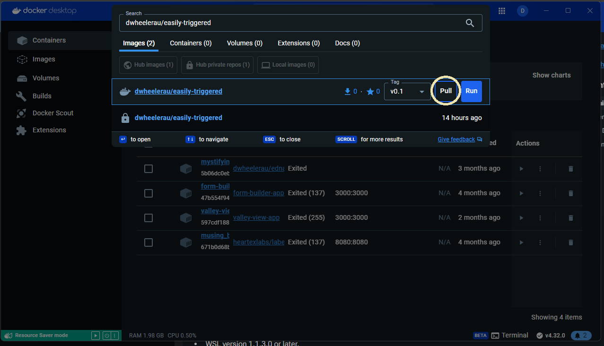

# Easily-triggered  


A docker container with [megadetector](https://github.com/microsoft/CameraTraps/blob/main/megadetector.md) 
v5. This will facility rapid removal of 
empty images from camera trap datasets. In my testing the 
false negative rate is <1%. The false positive rate 
is somewhat higher (~3-5%) depending on the
background. *Note* I've noticed that inclusion of bait stations in the frame can
increase the rate of false positive animal detections when the image should be
empty. GPU support is out of the box.       

The container is tagged `dwheelerau/easily-triggered:v0.1` and
is based on a cuda image to make Nvidia GPUs available for fast 
inference. On my computer with a GeForce GTX 1660 super it took 40 minutes to 
process ~15,000 camera trap images through Megadetector.  

The pipeline includes scripts that use the MD data to partition
the camera trap images based on specific classes: animal, empty.   A CSV file is 
also created that contains a summary of the detection results. The original 
directory structure and filenames are retained. So:
```
data/RECONX100/kangaroo-image.jpg  
data/RECONX101/empty-image.jpg  
```
Will be *copied* into:  
```
megadetector/animal/RECONX100/kangaroo-image.jpg  
megadetector/empty/RECONX101/empty-image.jpg  
```

## GUI workflow for Windows users  
1. Install [Docker desktop](https://docs.docker.com/desktop/install/windows-install/)  
2. Start docker desktop and search for `dwheelerau/easily-triggered` in the search bar at the top of the app  
  
3. Click the "pull" button (circled in the figure above) to obtain a copy of the image (~12GB download so this may take some time)      
4. Click on the `images` tab on the left hand panel (boxed in red) and then click the "play" button (yellow circle) to create a container for this image   

5. In the next step we are going to mount a directory containing our camera trap images inside the container, we will also create an open port that will allow our computer to interact with the docker container using the web-browser (note no internet connection is made here, it is all being run locally on your own computer)  
6. After clicking the play button, use the 'Option settings' drop down to add the following settings (see image below):
```
host port: 5000
Host path: path-to-a-directory-containing-your-images
container path: /project
```
  
In my case, I set the host path by using the three dots to navigate to a folder called `data` on the desktop (this folder contains two sub-foldrs with images called `100RECNX` and `101RECNX`)    
7. Click the "Run" button, which should bring up a terminal type window that lists the IP address that allow you to access the app (boxed below)   
  
8. Click on the first IP address and a web-browser window should open showing the welcome page, the image directories that you provided in the `host path` setting should be displayed (boxed below) 
  
9. Click the "process this data" button to goto the settings page  
10. The probability cut-off setting allows you to change the specificity of the image detection, if you want to capture all animals (at the risk of false positives) set a lower value (ie 0.2), if you want to avoid false positives (non-animal detections) set this as a higher value (ie 0.8). The default (0.3) is a good compromise setting.  
11. Click the `AI please filter my images` button to start the AI detection and a new 'running' window should open. A error window will appear if something goes wrong. 

The run-time of the app will depend on if you have a GPU available. 
  

When the app if finished a new window will display. The results will be in the same directory that contains your images, in a folder called `megadetector`. The images will be sorted in to animal, human, empty, and vechile.   

## Command line instructions
```
docker images
## get image ID, here it is b148546c199a, expose 5000
docker run -p 5000:5000 -it -v `pwd`:/project 0c0bbeef23c5 /bin/bash
# open web browser to http://172.17.0.2:5000/
```

## Snakemake automated workflow  
[Snakemake](https://snakemake.readthedocs.io/en/stable/) is used to make
a reproducible analysis pipeline. A
`config.yaml` file allows the workflow to be modified as required.  

1. From docker desktop pull the image tagged `dwheelerau/easily-triggered:v0.1`.  
2. Copy your images to a common directory, ie `data`.  
3. Open a terminal in the `data` directory.
4. Find the image ID using `docker images` command.  
```
docker images
#REPOSITORY                 TAG          IMAGE ID       CREATED             SIZE
#dwheelerau/easily-triggered      v0.1         ba21f33b2c0a   About an hour ago   12.4GB
```
5. Use the image ID to create and login to a container  
Linux:  
```
docker run --gpus all -it -v `pwd`:/project ba21f33b2c0a /bin/bash
```
Or Windozs:  
```
# use ${PWD} for powershell
docker run --gpus all -it -v %cd%:/project ba21f33b2c0a /bin/bash
```
6. Now inside the container, change into the `easily-triggered` directory.  
```
cd /build/easily-triggered
```
7. Check options in the `config.yaml` file. The probability cut-off values
can be increased in false positives become an issue. The yolo config 
`create_images` generates images with detections shown with boundary boxes
creates copies of the original images so takes up disk space, but useful
for testing to see how well the model is performing. If you need to edit this
file use the nano or vim editor `nano config.yaml`.     
```
# MD config
md-threshold: 0.3 # threshold for detection using MD
md-model: 'MDV5A' # MD model
base_image_dir: /project/ #image dir, dont change unless you know what you are doing
```
8. Run `snakemake --cores all all` to run the pipeline.  

OR 

To run individual steps, run megadetector use `snakemake --cores all megadetector` and
then to create a summary CSV run `snakemake --cores all json_to_csv`. The
final results will be summarised in `project.csv`.  

## Outputs   

| file        | desc |  
|-------------|------|
| project.csv | Number of MD detections for each image |
| megadetector-summary.txt | Summary of results for MD detections |
| megadetector| Images sorted by MD: animal, empty, person, vehicle    |
|              |                     |


## Step-by-step workflow if not using snakemake  
1. Find the Docker image ID and start container dog-go-moo mounting the current
working directory that contains your camera trap images.  
```
# find the image ID
docker images

# in this example the image ID is eb25af9717a5 (yours will be different)
docker run --gpus all -it -v `pwd`:/project eb25af9717a5 /bin/bash
```
The above command will mount your current working directory in `/projects/` 
in the container.  

2. Run Megadetector, assumes your images are in the current working 
directory      
```
# check your images are visible
ls /projects/
# run MD with a threshold of 0.3 for detection. Recursively look for images 
python -m megadetector.detection.run_detector_batch 'MDV5A' /project/ project.json --recursive --threshold 0.3  
```
The above command will create a file of detections called `project.json`.    

3. Run `script/json_to_csv.py` to get a human friendly output from the JSON 
file.  

`python scripts/json_to_csv.py -i project.json -t 0.3`   

4. Copy images from the original directories to subdirectories in a destination based on md classes. Note the script preserve the original sub-directory 
structure to avoid file name clashes and help keep your projects organised.   
`python ./scripts/collect_image_files.py -b ./data/ -i ./data/project.csv -o ./sorted`

The above command copies the images into directories in a directory called
`sorted` in your current working directory.  

## ToDo  
- GUI flask app for config and run.  
- Good instructions for ecologists using windozs.  

## License  
See MIT license (see [LICENSE](LICENCE) ).  

The licence for [megadetector](https://github.com/microsoft/CameraTraps?tab=readme-ov-file) (MIT).    
